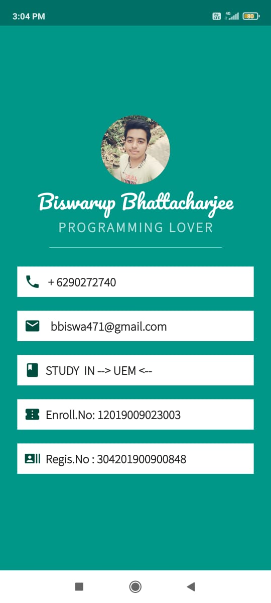

# MY CARD FLUTTER UI :star_struck:

[](https://shields.io/) [](https://shields.io/) [](https://shields.io/) [](https://shields.io/) [](https://shields.io/) [](https://shields.io/) [](https://shields.io/) [](https://shields.io/) [](https://shields.io/) [](https://shields.io/) [](https://shields.io/) [](https://shields.io/) [](https://shields.io/)

***This new Web application is created by Biswarup Bhattacharjee, student of BTECH, in University of Engineering and Management, Kolkata.***

**Email Id: bbiswa471@gmail.com.** 

**Contact No: 916290272740.** 

[](https://www.facebook.com/biswarup.bhattacharjee.5811) [](https://github.com/biswa2210)

## About :point_down: 


## APP DOWNLOAD LINK : :point_right: <a href="https://github.com/biswa2210/flutter-myCard-ui/raw/master/Biswa's_Card_base.apk" download>Click here to download</a> 

## Purpose :point_down:

 
## Importance :point_down:

## Folder Structure :point_down:
```bash
simple-covid-tracker
       ├── assets
       |     ├── 2.0x
       |     ├── 3.0x
       |     ├── fonts
       |     |    └── MBW.otf
       |     ├── count.png
       |     ├── death.png
       |     ├── fever.png
       |     ├── patient.png
       |     └── suspect.png
       ├── lib
       |    ├── app
       |    |    ├── repositries
       |    |    |       ├── data_repositries.dart
       |    |    |       └── endpointsdatas.dart
       |    |    ├── services
       |    |    |       ├── .gitignore
       |    |    |       ├── api.dart
       |    |    |       ├── app_services.dart
       |    |    |       ├── data_cache_service.dart
       |    |    |       └── endpointdata.dart
       |    |    └── ui
       |    |         ├── dashboard.dart
       |    |         ├── endpoint.dart
       |    |         ├── last_updated_date.dart
       |    |         └── show_alert_dialog.dart
       |    └── main.dart
       └── rest_api
              └── ncov_2019_api.http
```
     
## Making :point_down:
I have fetched the data from ncov_2019_api.http through [API](https://en.wikipedia.org/wiki/API) keys for app. I have used [FLUTTER](https://flutter.dev/?gclid=Cj0KCQjw38-DBhDpARIsADJ3kjliHdMH2hA97bBGqJtW5ORUUksCxpZ8cnrSWaH__HevGftAmP8AmvIaAhNlEALw_wcB&gclsrc=aw.ds) and [Dart](https://dart.dev/) in front end and backend.
## Getting Started

This project is a starting point for a Flutter application.

A few resources to get you started if this is your first Flutter project:

- [Lab: Write your first Flutter app](https://flutter.dev/docs/get-started/codelab)
- [Cookbook: Useful Flutter samples](https://flutter.dev/docs/cookbook)

For help getting started with Flutter, view our
[online documentation](https://flutter.dev/docs), which offers tutorials,
samples, guidance on mobile development, and a full API reference.
## Screenshots :point_down: 
<div align="center">
 <a href="card.jpeg"></a>
</div>


